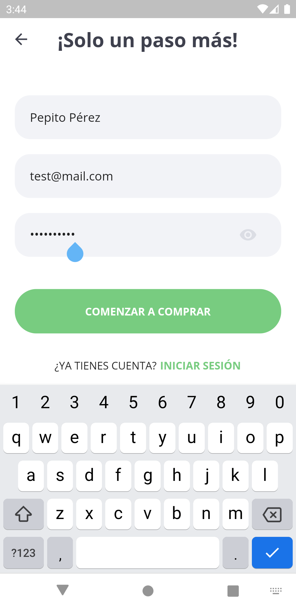

# Orexi 🍞: A platform to help reduce food waste

## 

---

## **About the app** 💬

### **Orexi means _appetite_ in greek.** 🌐

Orexi is a proof of concept for an app that aims to reduce food waste, by giving restaurants and clients a platform to exchange leftover food before it gets thrown away.

With Orexi, restaurants are able to post their leftover food, and -as long as its condition is appropiate for consumption- clients have the possibility to buy those leftovers at a lower price. The buyer can then recieve the food by takeout at the restaurants.

This app is not ready for production as it wasn't really planned for it, but the proof of concept and main building blocks are there. The development was made under a SCRUM method in two sprints of one month each. Some functionality is really underdeveloped.

The code is written under the Flutter framework (which uses the Dart language), and the backend is powered by Firebase, a Google-made solution used for non-relational database storage, encrypted authentication and user management.

This app was planned, designed and written for Ingeniería de Software I, an UNAL subject for the 2020-II semester.

---

## **Screenshots** 📷

#### - **Splash screen**

#### - **Sign-up propmt, where the user can decide whether to be a buyer or a seller**

#### - **Sign-up form, varies slighty from seller to buyer**

#### - **Main screen, where closest available dishes are shown. Distance value is a dummy, location API is yet to be implemented**

#### - **Sellers will be able to add discounts to existing products, which will be shown in this section**

#### - **Each user has access to a settings menu**

#### - **When selling, the home screen is slightly different than the buyer one, showing currently posted food and pending orders**

#### - **Settings menu is also different for the seller**

### **Product info and avalilability is updated to all sellers and users in real time, thanks to the functionality of Firebase's database implementation for Flutter.**

---
